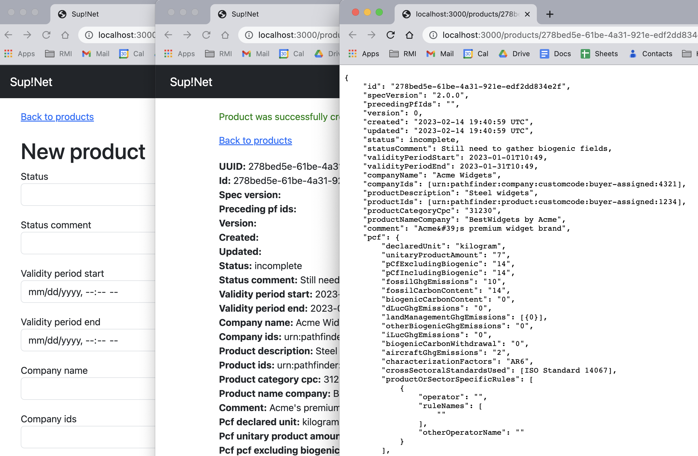

# README

## Intro

PCFer is a reference application to allow the exchange of Product Carbon Footprints (PCFs) in an automated, machine-readable way. It lets you both create digital PCF files to send to customers, and to receive them from vendors.

Importantly, PCFs can be exchanged between this app, and any other application or system that supports the open-source [PACT standard](https://wbcsd.github.io/data-exchange-protocol/v2/). Because it uses a standard and open format for emissions data, and exchanges it over HTTP, neither sender nor receiver needs to know details of the system on the other side, other than that it supports the same format. 

This basic app is for generic supply chain products and is not intended for production use in its current form, so caveat emptor. Later versions will support fields specific to particular products, such as steel, based on RMI's [steel accounting guidance](https://github.com/rmi/steel-guidance). Both this application and the steel accounting guidance are products of RMI's [Climate Intelligence Program](https://rmi.org/our-work/climate-intelligence/).
<br />
<br />



<br />

## Running it

To demonstrate data exchange and traceability this repo creates four containers, two postgres DBs, and two rails app--independed apps running the same code base, built and launched by docker-compose.yml. If you just want to run your own instance of the app you can user the Dockerfile by itself. To run the whole thing:

1. Install Docker

2. Edit your /etc/hosts file so you can more easily connect to each app. Change the line `127.0.0.1       localhost` to `127.0.0.1       localhost buyer seller`

3. Clone this repo
```
git clone https://github.com/rmi/pcfer.git
```

4. cd into repo and build images. The app was originally name supnet and the Rails app retains that name; until that gets changed (soon) the volume needs to retain it.

```
cd pcfer
docker build -t pcfer-toolbox -f Dockerfile.rails .

docker volume create --name seller-postgres
docker volume create --name buyer-postgres
docker volume create --name supnet
```

5. Initialize:

```
docker compose up --build
```

6. Connect to the shell running in the container. In a separate terminal run `docker ps` to list running containers, then, using the container name you just found, connect to it:

```
docker ps
```

which will probably return, in the NAMES column, the values `pcfer-seller-pcfer-1` and `pcfer-buyer-pcfer-1`. Instert those, or the equivalent values from your system, like this, to shell into each container:

```
docker exec -t -i pcfer-seller-pcfer-1 /bin/bash
docker exec -t -i pcfer-buyer-pcfer-1 /bin/bash
```

7. After building for the first time you'll see you need to create the databases. In a separate terminal run:

```
docker compose run seller-pcfer rails db:create
docker compose run seller-pcfer rails db:migrate
```

and

```
docker compose run buyer-pcfer rails db:migrate
docker compose run buyer-pcfer rails db:create
```

8. Once the database is set up, you can start the containers normally:

```
docker compose up
```

You should then be able to hit it at both http://seller:3030/ and http://buyer:3000/, and experiment locally with how buyers and sellers interact and exchange PCFs.

Once set up, you can run `docker compose up` any time you want to start the app+db containers.

## Connecting to the database
`psql --host=localhost --username=pcfer --port=6544 --dbname=supnet`

buyer's db port is 6544, seller's is 6543 (mapped in both cases to the standard postgresql on the container side)

## CURL
You can use `curl` send PCF data via command line, illustrating the point that data can be sent and received however you want. The API key should be the one supplied by the Vendor.

`curl -v -H 'Content-Type: application/json' -H 'X-API-Key: sk_J8HcZp4OJxS3Rq4EdwVGdg' -d "@test_pact.json" -X POST http://localhost:3000/products.json`

## Sources

Portions of the docker setup were taken from:
https://semaphoreci.com/community/tutorials/dockerizing-a-ruby-on-rails-application

## License
Copyright (c) 2023 John McGrath (jmcgrath@rmi.org) and [RMI](https://rmi.org). See [LICENSE][] for
details.

[license]: LICENSE.md
